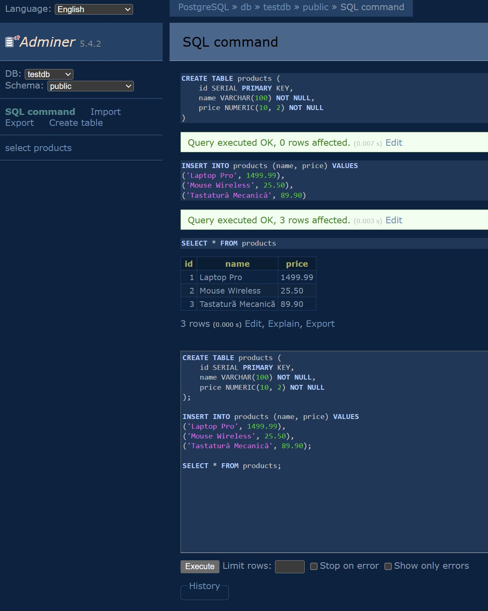
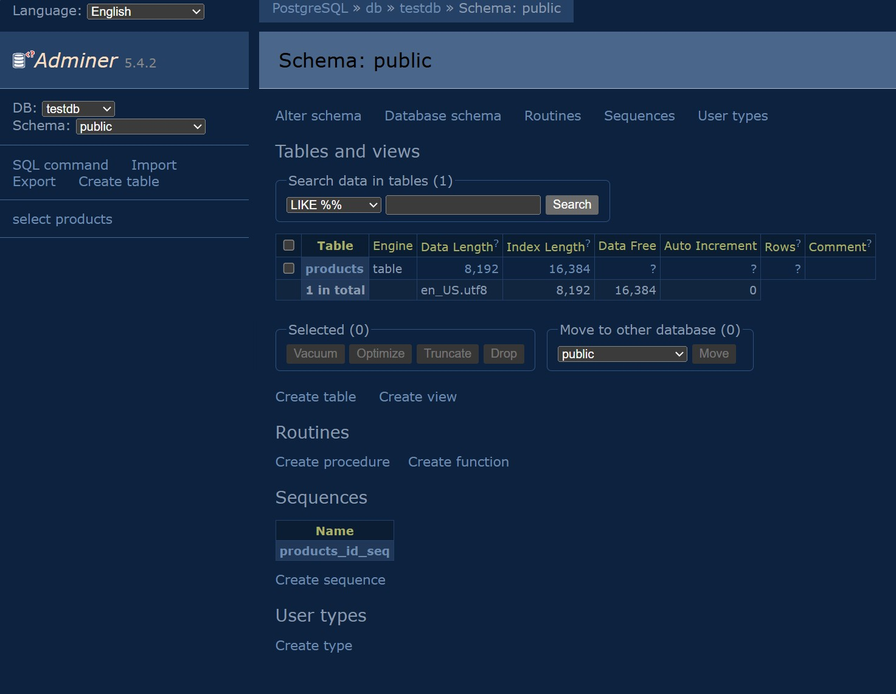

Folosim "docker compose down -v" ca sa nu generam conflicte pentru urmatorul set de testare, si aici ca si mici exemple ar fi:
* teste care ar trebui sa pice, trec (false positive)
* teste care ar trebui sa treaca, cad (false negative)
* date duplicate, conflicte de ID-uri, s.a.m.d.